## Lab Description

- Create a free tier RDS

---

- Engine selection

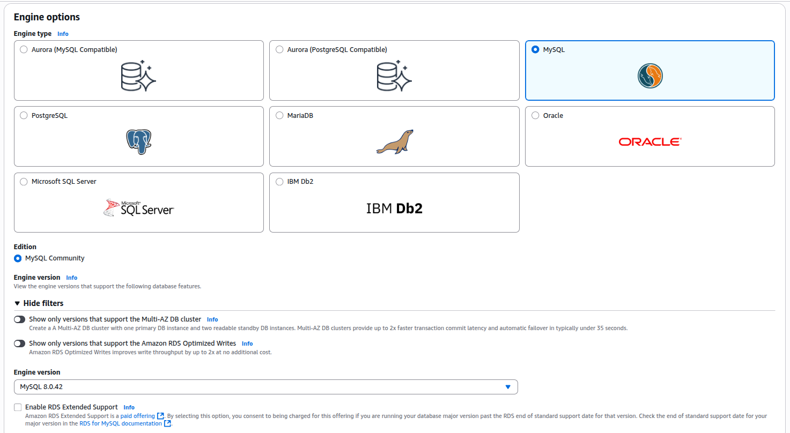

- Multi AZ setup

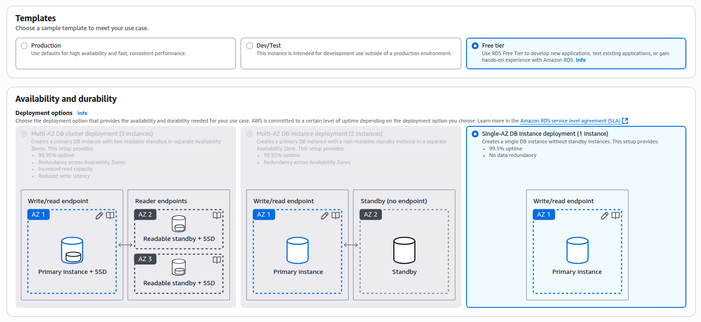

- Database and credetials setup

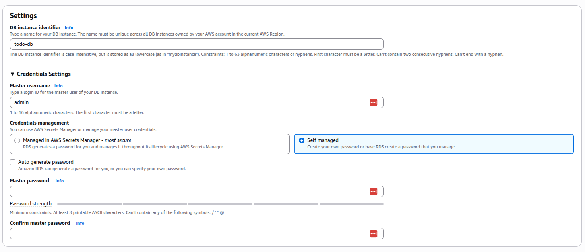

- Instance Classes

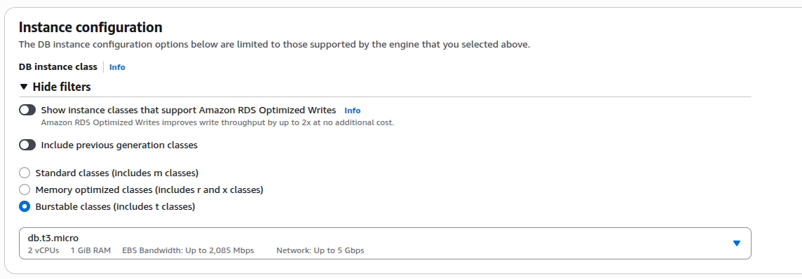

- Storage

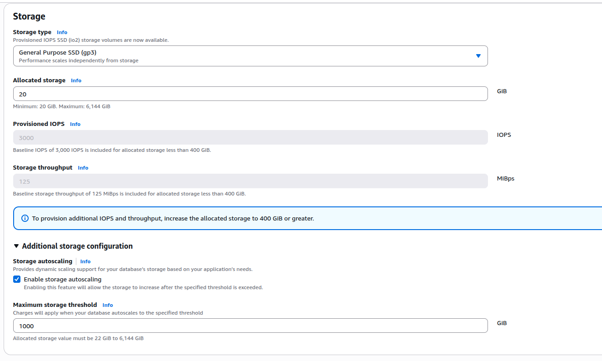

- Connectivity

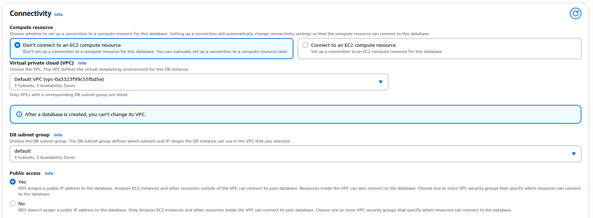

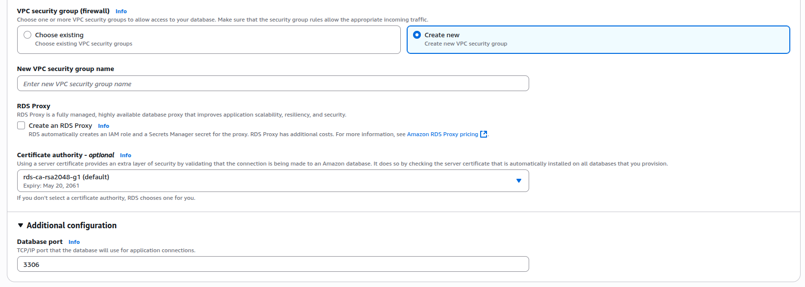

- Database authentication

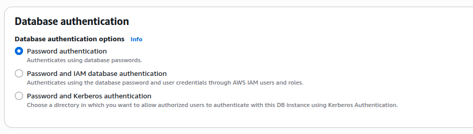

- Monitoring

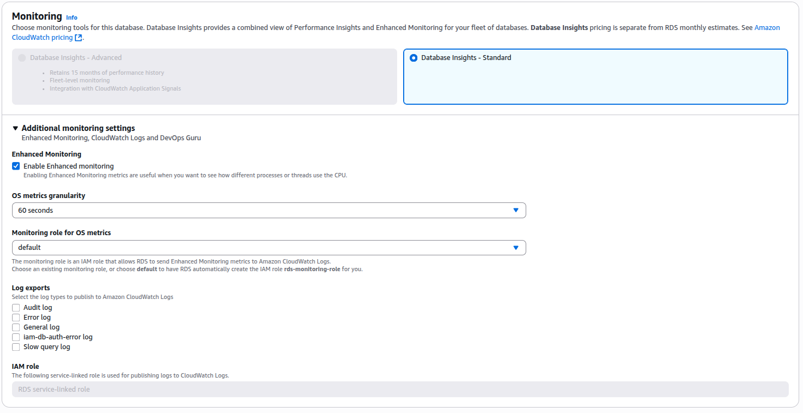

- Additional

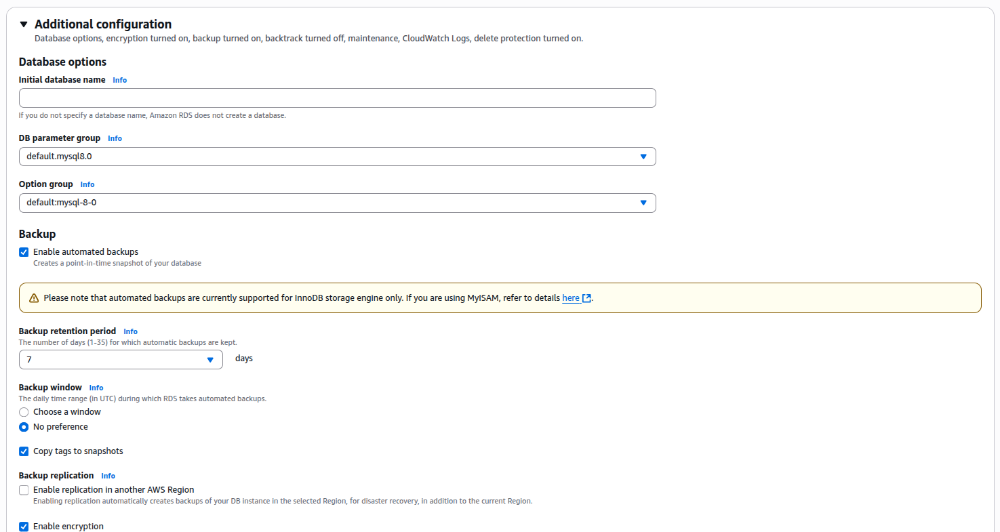

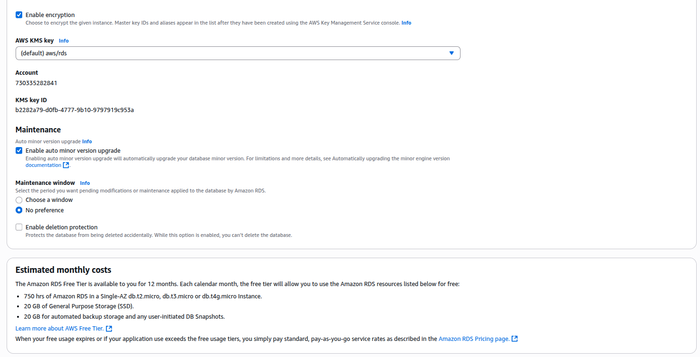
