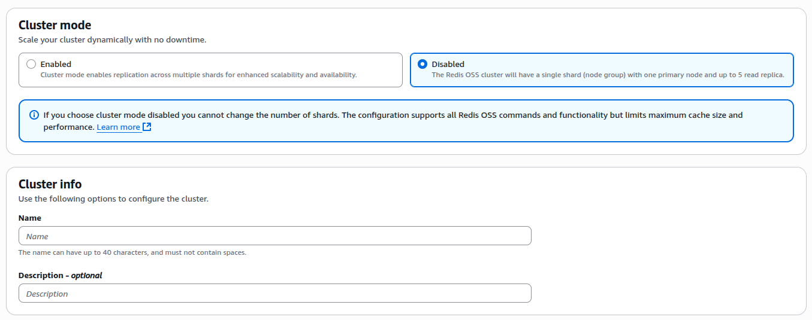

## Lab Description

- Create a redis cluster

---

## Create Redis OSS cache

- Configuration

  

- Cluster mode

  

- Cluster info

  

- Location

  

- Cache settings

  

- Connectivity

  

- Availability Zone placements

  

- Security

  

- Backup

  

- Maintenance & Logs

  

## Connecting to an application

- You should be using the primary endpoint.

  
