## Lab Description

Connect a Classic Load Balancer to EC2 instances.

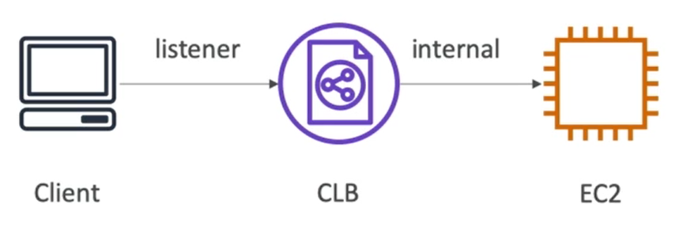

---

## EC2

1. Create your Amazon Linux EC2 instance.

2. Add this under user data scripts

    ```
    #!/bin/bash
    yum update -y
    yum install -y httpd
    systemctl start httpd
    systemctl enable httpd
    echo "<h1>Hello from $(hostname -f)</h1>" > /var/www/html/index.html
    ```

    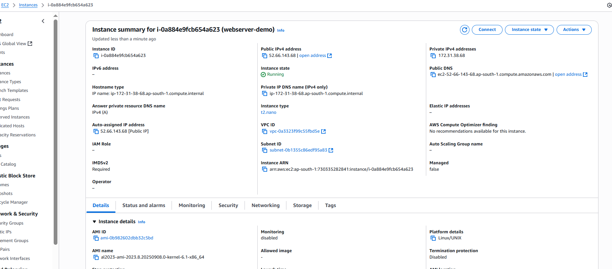

3. EC2 SG: Allow inbound PORT 80

    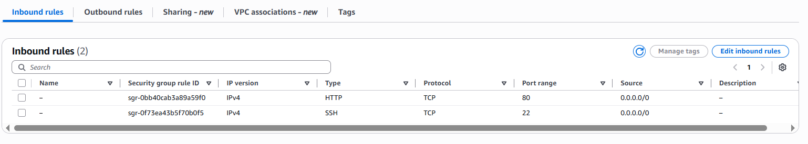

    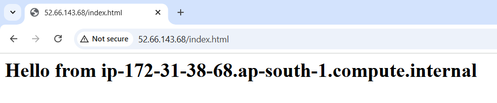

## Load Balancer

-   Go to "EC2" > "Load Balancers" > "Create Load Balancer"
-   Using the classic load balancer is now depriciated. It is adviced to use ALB or NLB.

    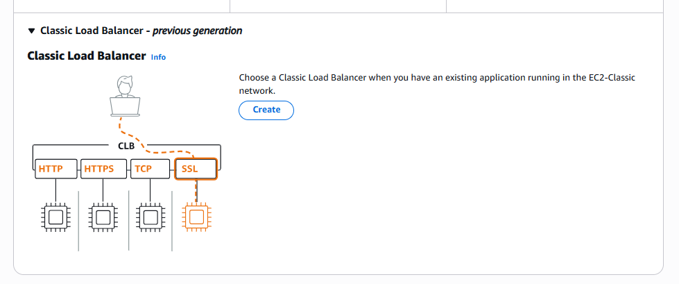

-   Listeners and routing rules:

    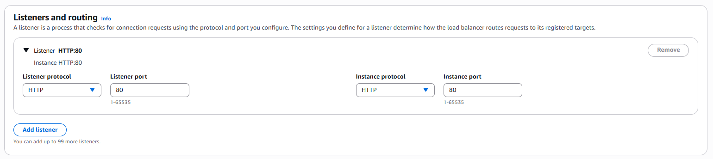

-   Network mapping: Make your CLB highly available the more AZs you select. Because LB runs nodes in each AZ. If one AZ goes down, traffic still flows through the other.

    -   Cost: You pay for the load balancer as a whole, not for each node in every AZ.

    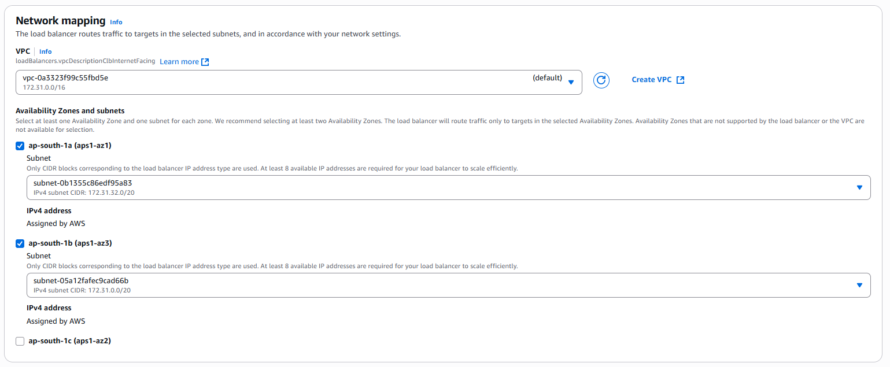

-   Add your instance:

    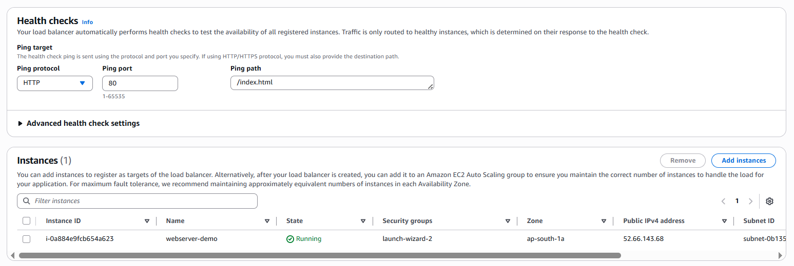

    -   Healthcheck: Add a working page or endpoint. If it got an error. The LB will treat it as unhealthy and will not route traffic to the EC2.

-   Create new SG for "webserver-demo-clb"

    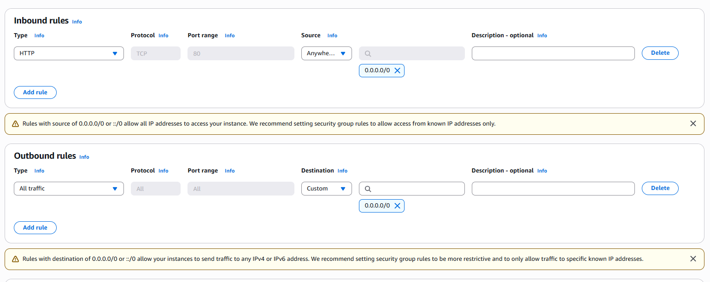

-   Now attach it to the CLB

    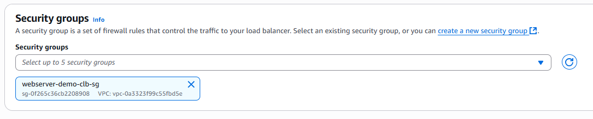

-   Now we can access the EC2 with your CLB

    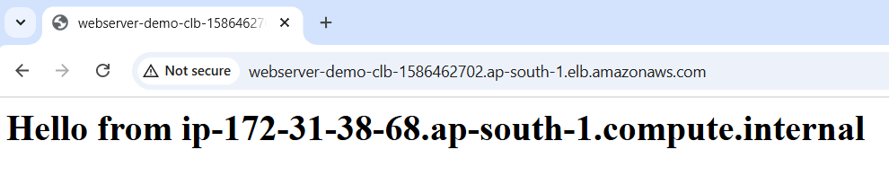

## [Addition] Tighten Security

-   On your EC2 SG add your CLB SG as the source.

    -   This will only allow traffic comming in from the CLB.

    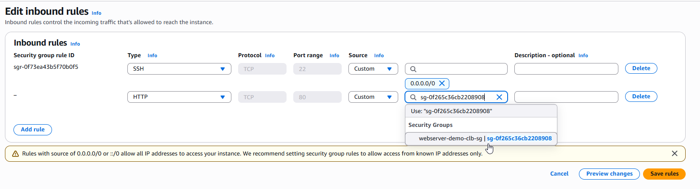

-   Now only access on CLB works:

    

-   Direct access to http://52.66.143.68/index.html will no longer work.

## Adding new instances to your CLB

-   You currently only have one EC2 (webserver-demo). Let's create 2 more. Make sure to add the EC2 (webserver-demo) SG. So the 3 EC2s use the same SG.

    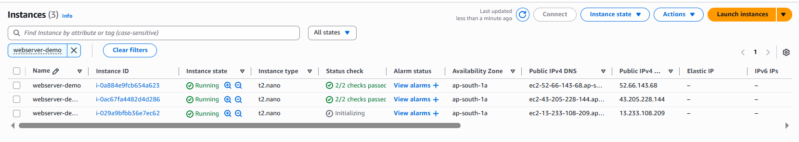

-   Add the newly created 2 to your CLB instances.

    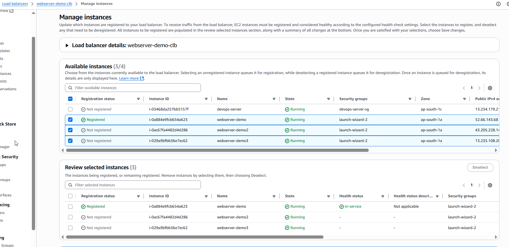

-   Load balancing in action

    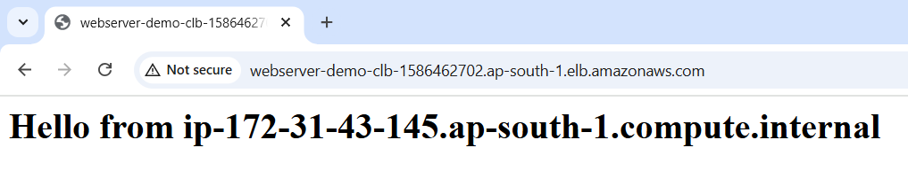
    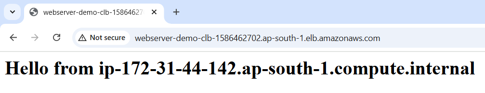
    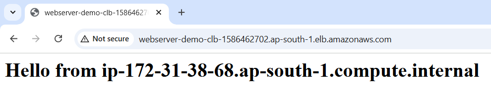
