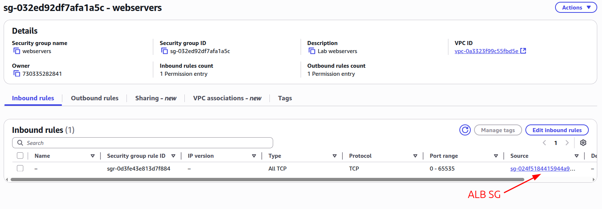

## Lab Description

Connect an Application Load Balancer to multiple EC2 instances with path based routing. For high availability make sure to run your ALB on 2 or more AZs.


---

## EC2

- I will create 3 EC2 instances that uses the same SG. I can later edit the name for each EC2.

  

- EC2 SG: Allow inbound PORT 80 (SG: webservers-sg)

  

- Attached this user data to install HTTP server

  ```
  #!/bin/bash
  yum update -y
  yum install -y httpd
  systemctl start httpd
  systemctl enable httpd
  echo "<h1>Hello from $(hostname -f)</h1>" > /var/www/html/index.html
  ```

## ALB

- Create a new ALB: webservers-alb
- SG: webservers-alb-sg

  

- Run your ALB on multiple AZs
  

- Creating Target Groups

  - Target Group 1: Type Instance; Include webserver1 and webserver2; Protocol version: HTTP1

    

  - Target Group 2: Type Instance; Include webserver3; Protocol version: HTTP1

    

- To register a listener port to your ALB. You need to add one target group to the listener. You can change the rules later.

  

---

- After the ALB is created.You can change the routing rules of the listener.

  

  

- Also make sure to edit EC2 (webserver) SG to remove direct traffic and only allow traffic coming inbound from ALB.

  

## Let's test it out

- Endpoint: `/` (Target Group 1)

  

- Endpoint: `/user` (Target Group 1)

  - Target Group 1 EC2 web servers are not condifgued to /user endpoint. But the forwarding is working.

  

- Endpoint: `/search` (Target Group 2)

  - Target Group 2 EC2 web server is not condifgued to /search endpoint. But the forwarding is working.

  

- Endpoint: `/not-found` (Fixed response)

  
