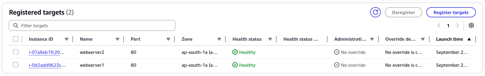

## Lab Description


- Unlike an Application Load Balancer (ALB), the NLB operates at Layer 4 (TCP/UDP) and does not have its own security groups. It just forwards traffic to the targets.

---

## EC2

- Create new SG for EC2s (webserver-sg).

  - Reason to allowing all HTTP traffic: NBL just forward the traffic to the EC2s. So from the EC2s prespective the traffic doesn't look like it's coming from the NBL rathr see it as a request coming from an external client.

  

- I will create 2 EC2 instances that uses the same SG. I can later edit the name for each EC2.

- Attached this user data to install HTTP server

  ```
  #!/bin/bash
  yum update -y
  yum install -y httpd
  systemctl start httpd
  systemctl enable httpd
  echo "<h1>Hello from $(hostname -f)</h1>" > /var/www/html/index.html
  ```

  

## NLB


- For NLB we can even assign an elastic IP.

  

- Create target group (target-group-1)

  

- Now connect to the target group and create your NLB

  

- Target group health checks (PASS)

  - The reason you see the healthchecks pass is because of the EC2 SG that is allowing all external HTTP traffic (0.0.0.0/0)

  

  

---

## Problem?

- Now let's check if the laod balancer is working?

  

- Reason:

  - Historically, Classic NLBs ignored Security Groups.

  - Today: AWS added a “default SG for NLB” feature when you create them in certain modes.

  - You’ll see a security group automatically associated with the NLB’s Elastic Network Interfaces (ENIs).

  - If that SG is restrictive, it will silently block all inbound requests. It might be set to allow only health check sources (e.g., AWS internal IP ranges).

  - That would explain why targets show healthy but you get timeout from the public internet.

## Solution

- Create a new SG (webserver-nlb-sg) for your NBL or edit the exisiting one:

  - Add inbound rule: TCP 80 from 0.0.0.0/0

    

  - Add the new SG removing the default one

    

- It works

  
