## Lab Description

- Setup an auto scaling group

---

## Creating ASG

- To start from scratch make sure all the **web-server** EC2 instances are removed.
- Now create an ASG. EC2 > Auto Scaling groups > Create Auto Scaling group

  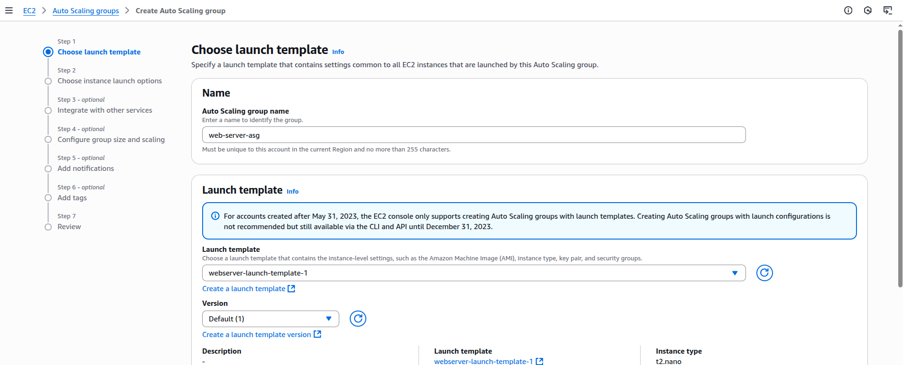

- Give it a name. Then create a new launch template.

- After created the `webserver-launch-template-1`:

  - Networking & subnets

    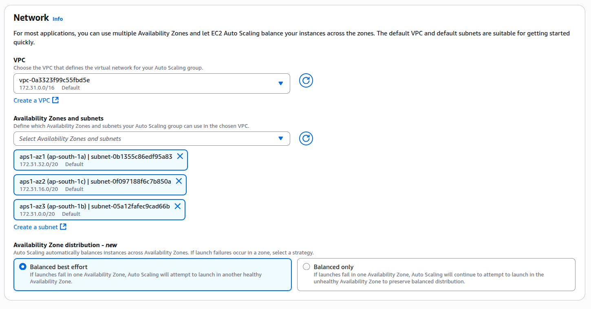

  - Link a load balancer (used my previous ALB)

    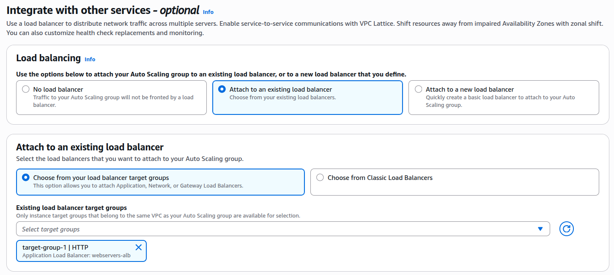

    - ALB SG (webservers-alb-sg)

      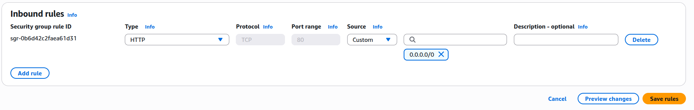

  - Let ELB do the health checks

    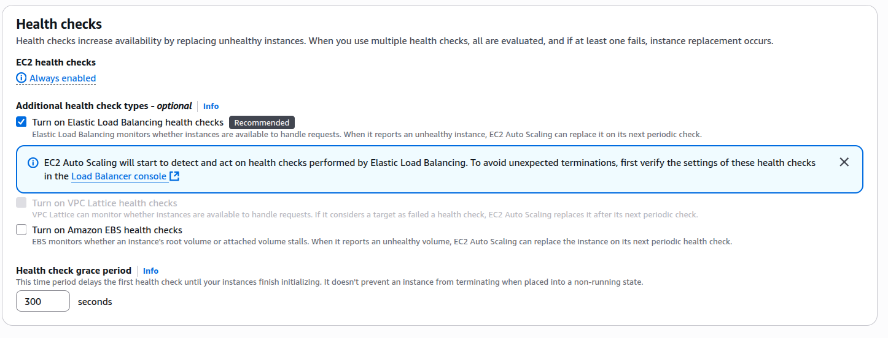

  - Scaling

    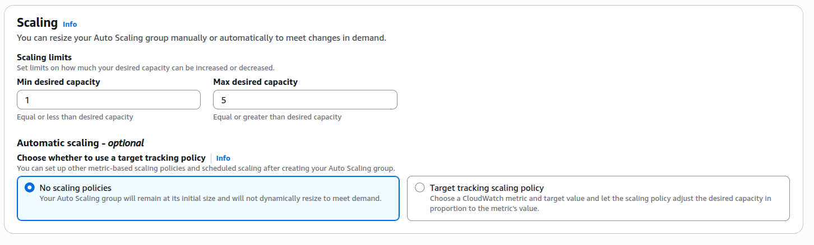

### New launch template

- Launch Template name: webserver-launch-template-1

- Secruity Group: webserver-sg

- User data:
  ```
  #!/bin/bash
  yum update -y
  yum install -y httpd
  systemctl start httpd
  systemctl enable httpd
  echo "<h1>Hello from $(hostname -f)</h1>" > /var/www/html/index.html
  ```

* Create the launch template

  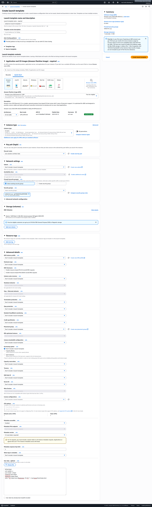

### After creating the ASG

- You can view all the ASG activities here

  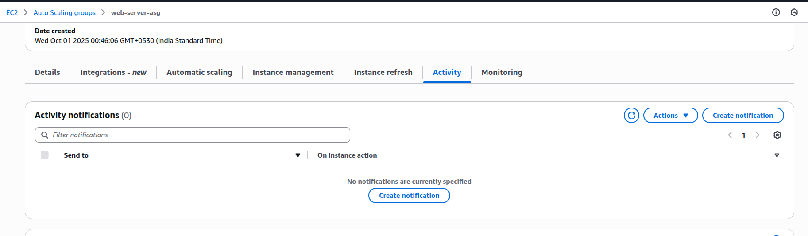

- Instance management: One EC2 was created to satisfy the min scaling count (1)

  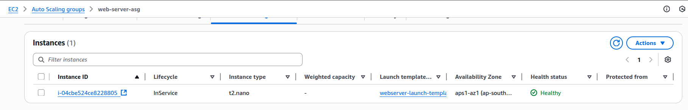

- The instances spawn up by the ASG automatically attached to ALB target group since we already attached the ALB to the ASG.

- ALB Target Group (Healthy)

  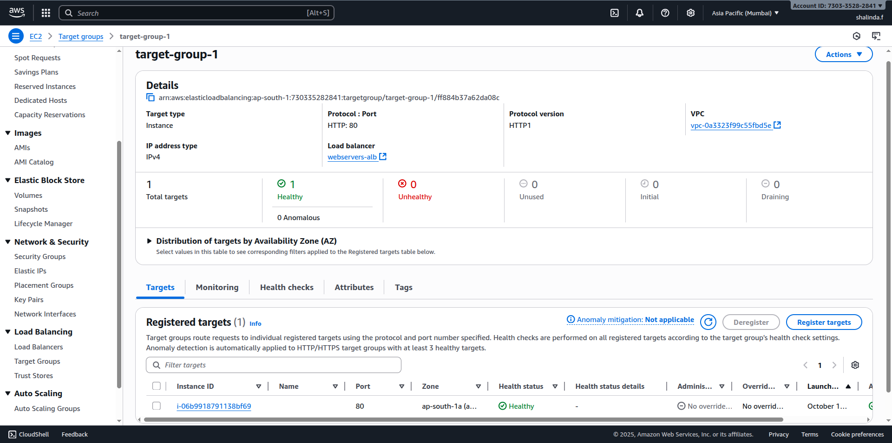

### Changing Desired capacity

- Before the Desired capacity was 1. Let's set it to 2.

  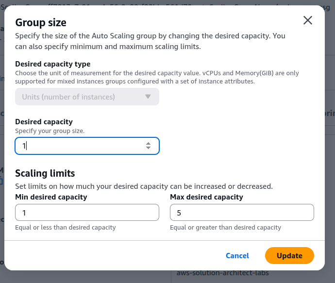

  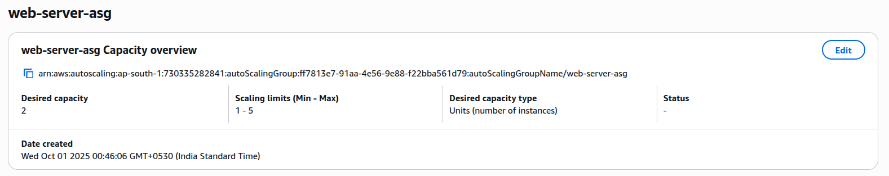

- The ALB now should spawn up another additional EC2 totaling to 2 EC2 instances.

  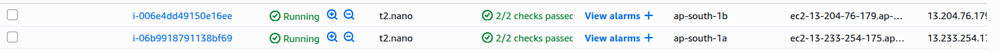

## Notes

- Access via the ALB URL works

  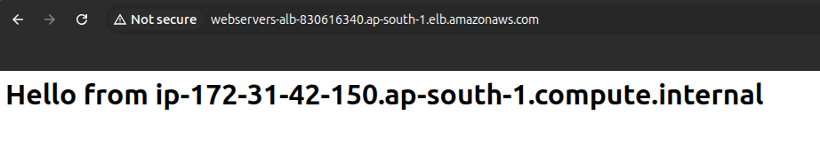

- Access directly via EC2 public IP doesn't work. Even through you enabled HTTP inbound rules via SG (webserver-sg) to your EC2. This is because (Typical ALB + ASG Design):

  - **In production, EC2 instances behind an ALB are usually in private subnets.**

  - **They have no direct Internet ingress — only the ALB can send traffic to them.**

  - Best Practice

    - **Don’t access EC2 instances directly when they’re part of an ALB/ASG setup.**

    - **Instead: Clients → ALB DNS → EC2 targets**

      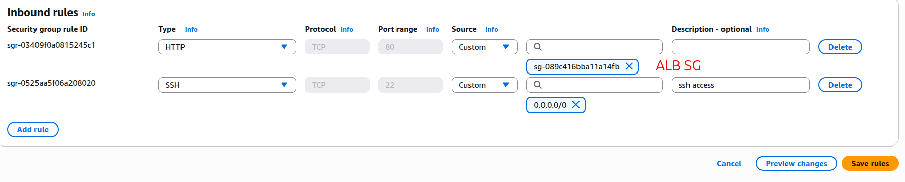
