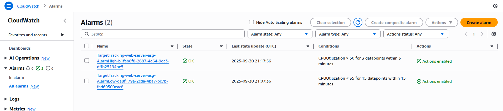

## Lab Description

- If the CPU usage spikes 50% scale out.

- Here we focus on creating a auto scaling dynamic policy.

---

## Creating Dynamic policy

- EC2 > Auto Scaling groups > web-server-asg > Automatic Scaling

  

- Dynamic scaling policy

  

  

- Now to monitor. Go to EC2 > Auto Scaling groups > web-server-asg > Monitoring

  

## Stress Test

- Time to spike the CPU utilization up. Use this tool

  - https://gist.github.com/mikepfeiffer/d27f5c478bef92e8aff4241154b77e54

    ```
    sudo amazon-linux-extras install epel -y
    sudo yum install stress -y
    ```

    or

    ```
    sudo yum update
    sudo yum install stress
    ```

- Generate CPU stress:

  ```
  stress --cpu <number-of-threads>
  $ stress --cpu 4
  stress: info: [28730] dispatching hogs: 4 cpu, 0 io, 0 vm, 0 hdd
  ```

  

* New activity created (This is based on the Target Tracking Policy - Dynamic Policy)

  

  

  

- Load balancer

  

  

- Cloudwatch alarms: When creating the ASG policy it automatically creates Cloudwatch alarms triggers.

  
