## Lab Description

- Create an AWS Aurora

---

- Engine selection

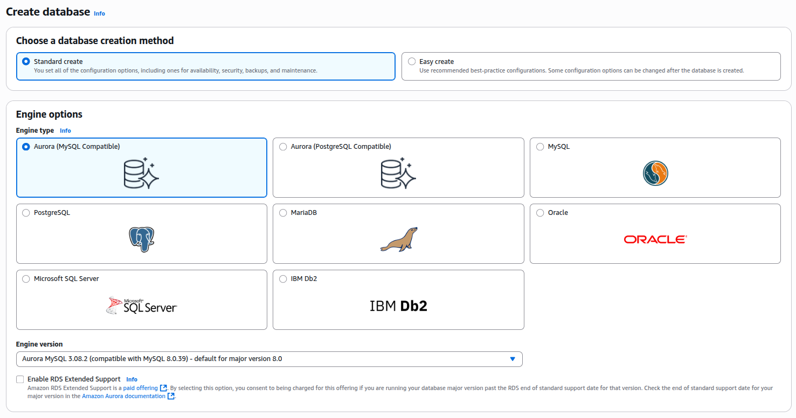

- Templates

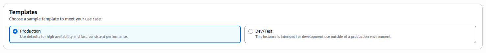

- Database and credetials setup

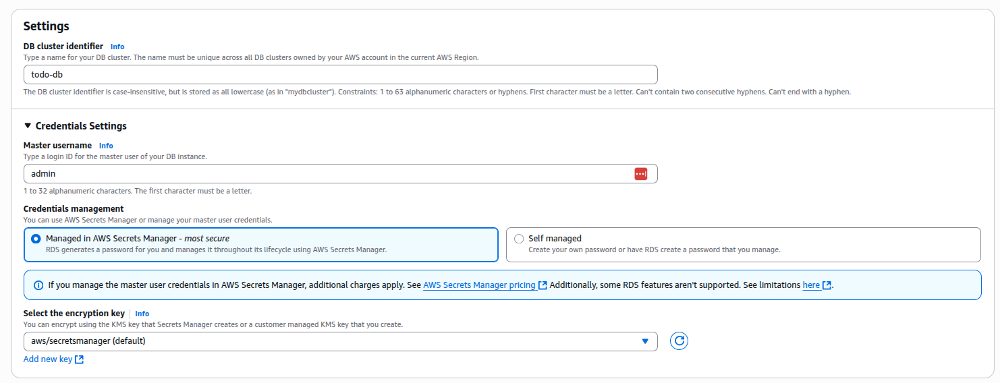

- Cluster storage configuration

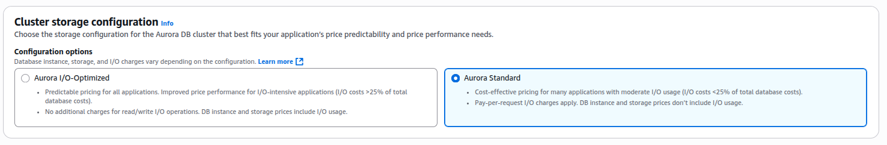

- Instance Classes

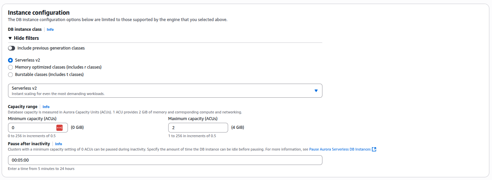

- Availability & durability

  - If you wish to have multi AZ. If you select either yes/no remember your storage layer is replicated across 3 AZs.

  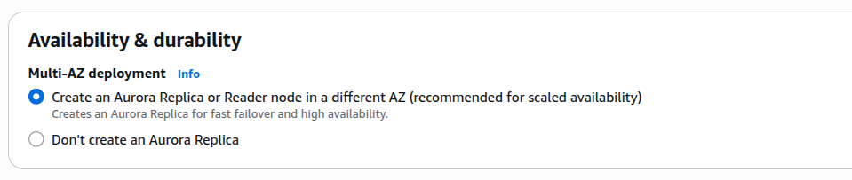

- Connectivity

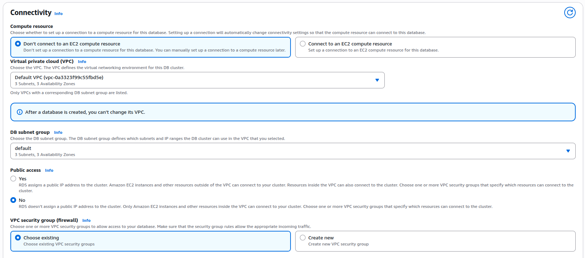

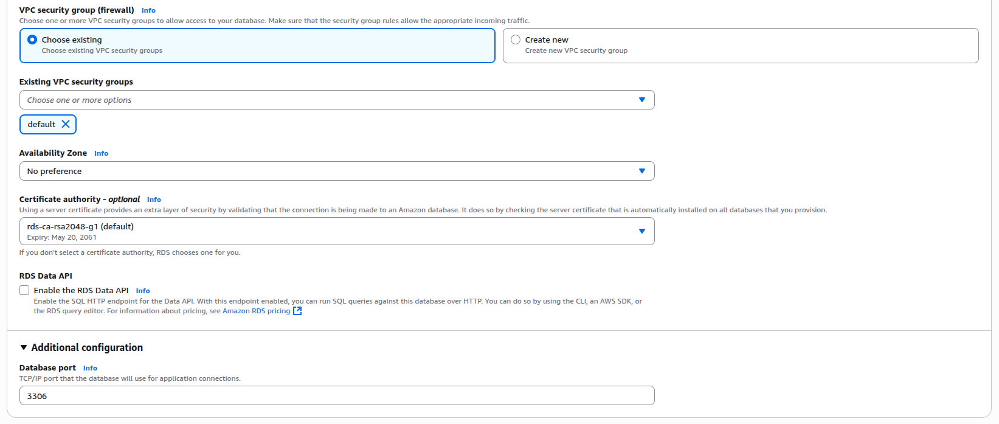

- Database authentication

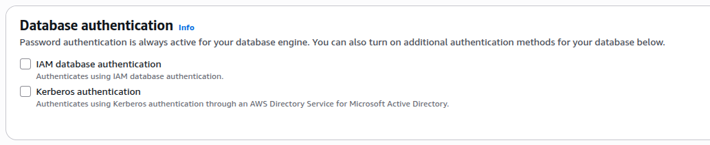

- Monitoring

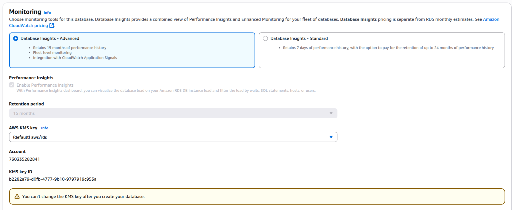

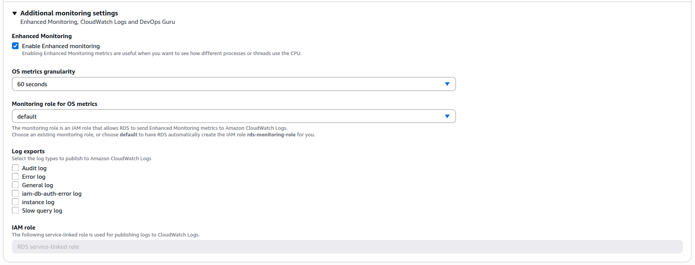

- Additional

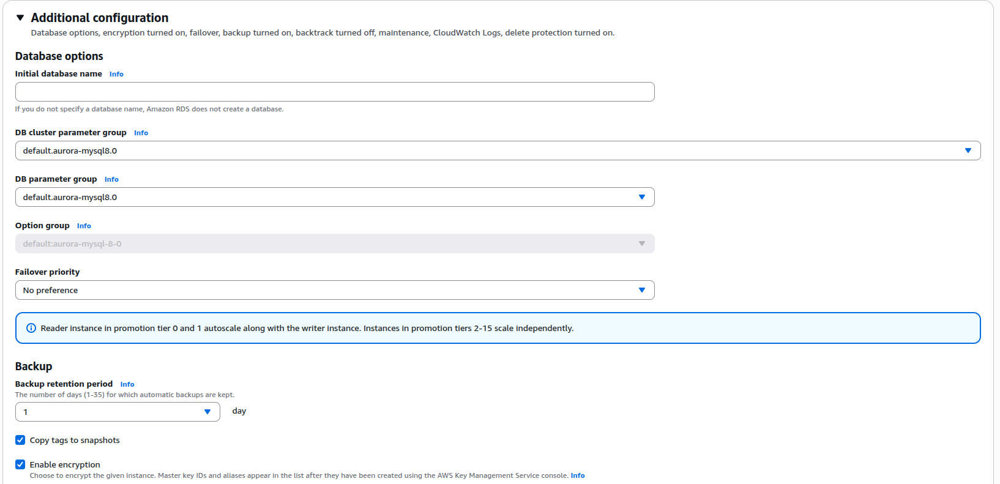

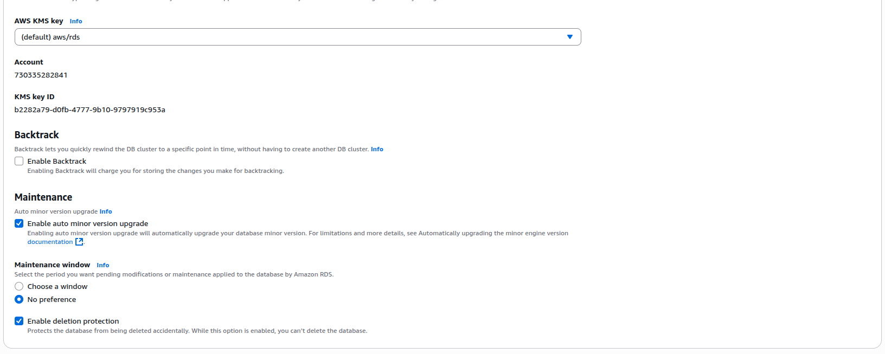

## After creating your Aurora Cluster

- You will see 2 endpoints.

  1. Writer endpint = Your main DB which has write + read. In your app use this endpoint.

  2. Reader = Only read purpose from main DB. For Analytical purpose use this READ only endpoint.

  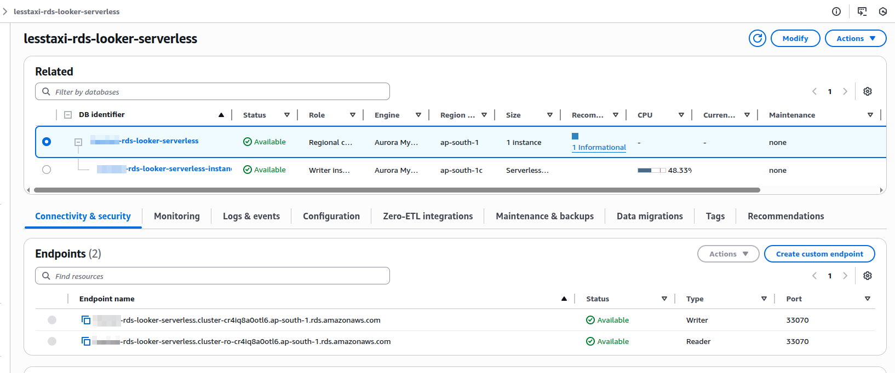

* More options

  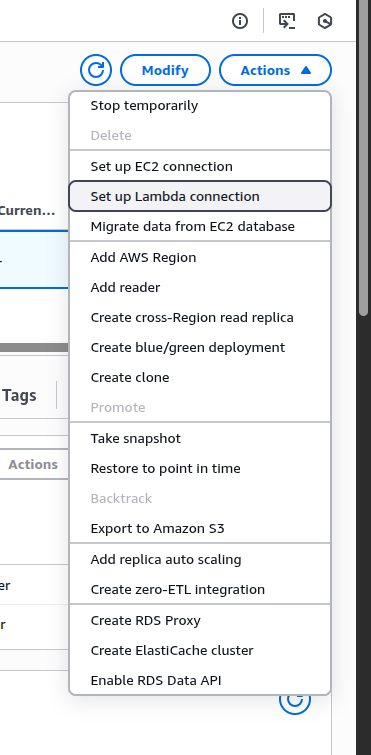

1. Creating auto scaling Read Replica policy

- Click "Add Auto Scaling policy"

  

  - It's tell you to add more read replica if the overall usage is >60%

- Minimum and Maximum Replica capacity

  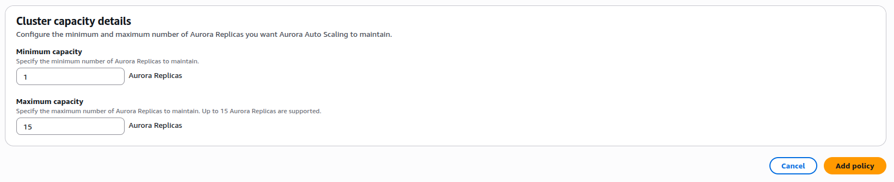

2. If you want to do Global Aurora. You can add a new AWS Region

   - Click "Add AWS Region" and create a new Aurora Cluster.
