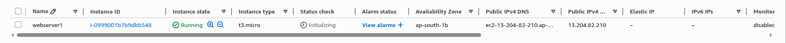
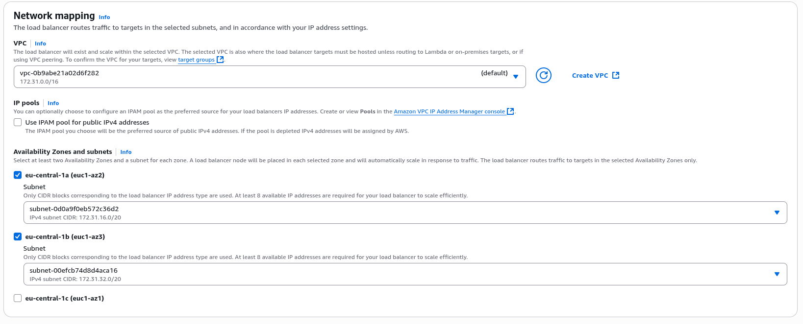

## Lab Description

- In this section we setup 3 EC2 web server instances.

---


## EC2

- Each EC2 must be in separate region AZ

    

    

    

    - User data

        ```
        #!/bin/bash
        yum update -y
        yum install -y httpd
        systemctl start httpd
        systemctl enable httpd
        echo "<h1>Hello from $(hostname -f)</h1>" > /var/www/html/index.html
        ```

    - EC2 instances (I renamed them in an incremental order)

        - IP: 13.204.82.210 (ap-south-1b)

        
        
        - IP: 35.175.175.177 (us-east-1c)

        

        - IP: 52.59.207.32 (eu-central-1b)

        


## ALB
- ALB: Now let's create an ALB in eu-central-1b. For the target group I will provide the eu-central-1b EC2 (webserver-3)

    

    - New SG for ALB

        

    

    - New target group

        

        - webserver-3 instance added to target group

            
    
    

## Results

- Asia Pacific: 13.204.82.210 (ap-south-1b)

    

- United States: 35.175.175.177 (us-east-1c)

    

- Europe: 52.59.207.32 (eu-central-1b)

    

- ALB (Europe) [webserver-alb-1324482464.eu-central-1.elb.amazonaws.com](webserver-alb-1324482464.eu-central-1.elb.amazonaws.com)

    


### Table

| Region        | IP Address     | Availability Zone | Notes                                                                 |
|----------------|----------------|-------------------|------------------------------------------------------------------------|
| Asia Pacific   | 13.204.82.210  | ap-south-1b       | —                                                                      |
| United States  | 35.175.175.177 | us-east-1c        | —                                                                      |
| Europe         | 52.59.207.32   | eu-central-1b     | —                                                                      |
| ALB (Europe)   | —              | —                 | [webserver-alb-1324482464.eu-central-1.elb.amazonaws.com](http://webserver-alb-1324482464.eu-central-1.elb.amazonaws.com) |
