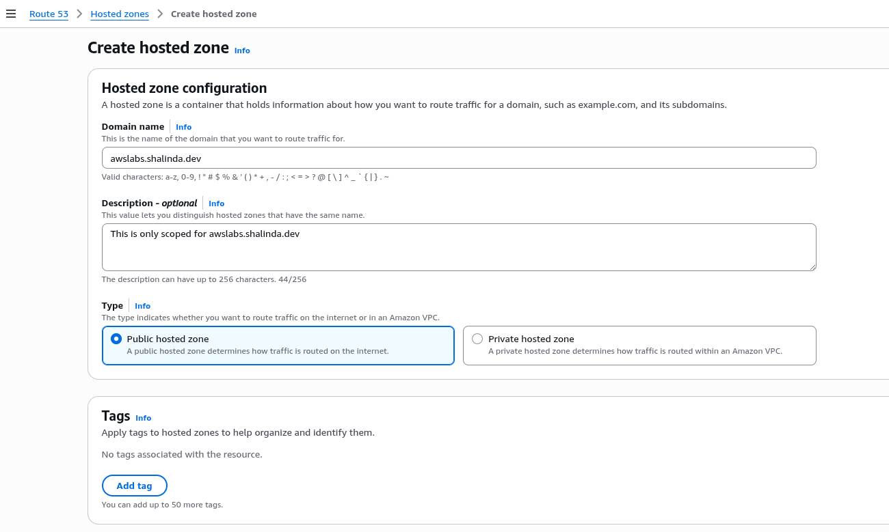
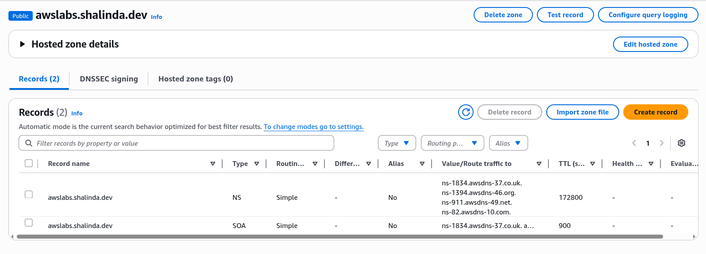
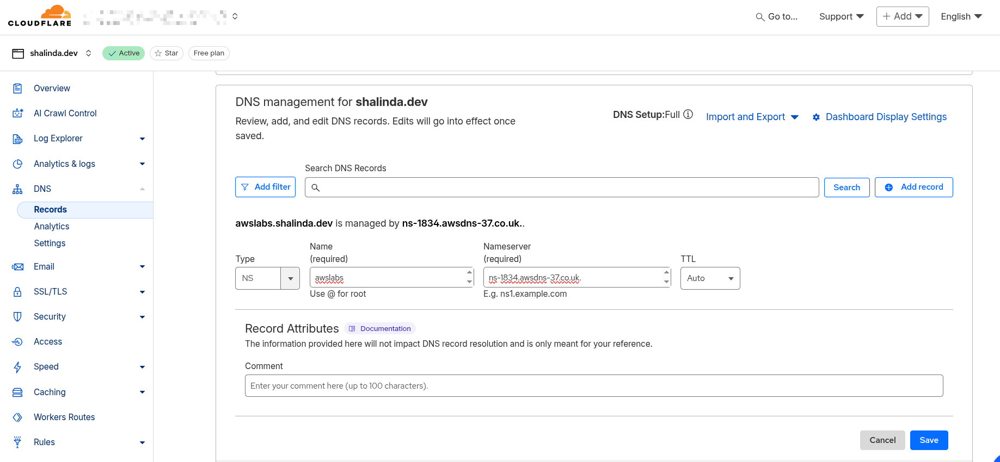
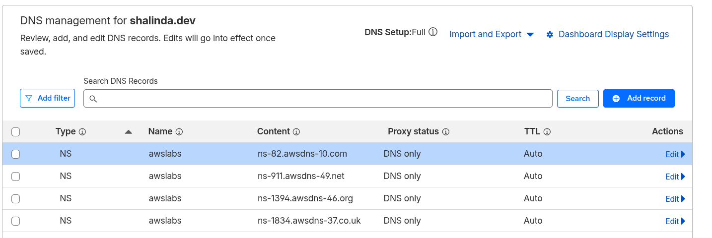

## Lab Description

- I have my main domain shalinda.dev DNS managed by Cloudflare. I don't want to change the entire nameservers.

- So, I plan to use a subdomain awslabs.shalinda.dev and point it to AWS. So I only use AWS DNS (Route 53) to manage `awslabs.shalinda.dev` subdomain.

- NOTE: If you want to point to a domain (example.com). Add the AWS NS records to your domain registar DNS settings. This way you can manage DNS for your domain via AWS Route 53.

---

## Create new Public Hosted Zone



- You will find the NS records for the created hosted zone.

    

- Now I need to go to cloudfalre DNS setting and create 4 NS records

    - AWS NS records

        ```
        ns-1834.awsdns-37.co.uk.
        ns-1394.awsdns-46.org.
        ns-911.awsdns-49.net.
        ns-82.awsdns-10.com.
        ```
    
    - Add new NS record for each 4 NS record like so:

        

        

- Now AWS Route 53 manages the DNS records for `awslabs.shalinda.dev` subdomain.