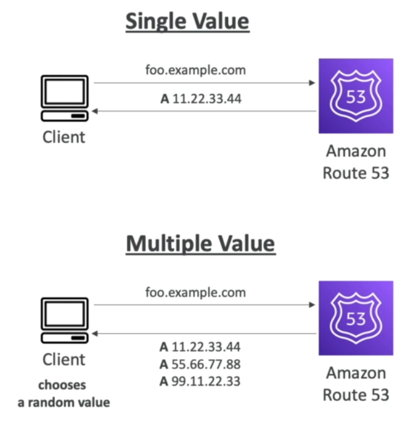
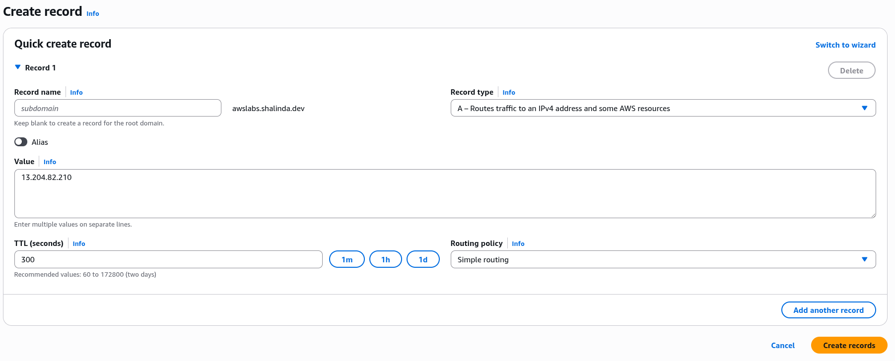
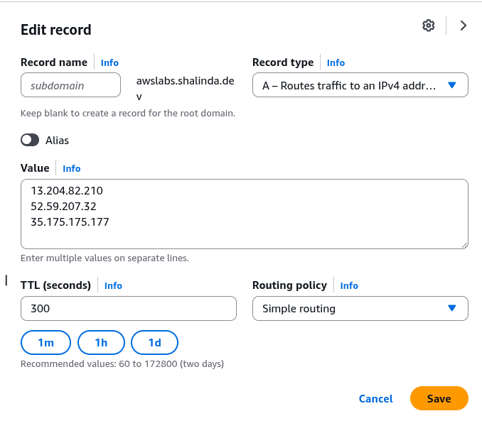

## Lab description

- In this section we will look at how simple routing policy works.

    


## Creating a simple routing policy

- Add an A new record **(single valued)**

    


- Testing:

    ```
    $ dig test.awslabs.shalinda.dev

    ; <<>> DiG 9.18.33 <<>> test.awslabs.shalinda.dev
    ;; global options: +cmd
    ;; Got answer:
    ;; ->>HEADER<<- opcode: QUERY, status: NOERROR, id: 7665
    ;; flags: qr rd ra ad; QUERY: 1, ANSWER: 1, AUTHORITY: 0, ADDITIONAL: 0

    ;; QUESTION SECTION:
    ;test.awslabs.shalinda.dev.	IN	A

    ;; ANSWER SECTION:
    test.awslabs.shalinda.dev. 217	IN	A	13.204.82.210

    ;; Query time: 2 msec
    ;; SERVER: 192.168.1.1#53(192.168.1.1) (UDP)
    ;; WHEN: Thu Oct 16 00:10:32 +0530 2025
    ;; MSG SIZE  rcvd: 59
    ```

    ```
    $ curl http://awslabs.shalinda.dev
    <h1>Hello from ip-172-31-8-103.ap-south-1.compute.internal</h1>
    ```

- Add record **(multiple valued)**

    

    ```
    $ dig awslabs.shalinda.dev

    ; <<>> DiG 9.18.33 <<>> awslabs.shalinda.dev
    ;; global options: +cmd
    ;; Got answer:
    ;; ->>HEADER<<- opcode: QUERY, status: NOERROR, id: 24540
    ;; flags: qr rd ra; QUERY: 1, ANSWER: 3, AUTHORITY: 4, ADDITIONAL: 9

    ;; OPT PSEUDOSECTION:
    ; EDNS: version: 0, flags:; udp: 4096
    ;; QUESTION SECTION:
    ;awslabs.shalinda.dev.		IN	A

    ;; ANSWER SECTION:
    awslabs.shalinda.dev.	20	IN	A	52.59.207.32
    awslabs.shalinda.dev.	20	IN	A	13.204.82.210
    awslabs.shalinda.dev.	20	IN	A	35.175.175.177

    ;; AUTHORITY SECTION:
    awslabs.shalinda.dev.	300	IN	NS	ns-911.awsdns-49.net.
    awslabs.shalinda.dev.	300	IN	NS	ns-1834.awsdns-37.co.uk.
    awslabs.shalinda.dev.	300	IN	NS	ns-82.awsdns-10.com.
    awslabs.shalinda.dev.	300	IN	NS	ns-1394.awsdns-46.org.

    ;; ADDITIONAL SECTION:
    ns-82.awsdns-10.com.	77693	IN	A	205.251.192.82
    ns-82.awsdns-10.com.	77693	IN	AAAA	2600:9000:5300:5200::1
    ns-911.awsdns-49.net.	77551	IN	A	205.251.195.143
    ns-911.awsdns-49.net.	77551	IN	AAAA	2600:9000:5303:8f00::1
    ns-1394.awsdns-46.org.	77694	IN	A	205.251.197.114
    ns-1394.awsdns-46.org.	77694	IN	AAAA	2600:9000:5305:7200::1
    ns-1834.awsdns-37.co.uk. 119177	IN	A	205.251.199.42
    ns-1834.awsdns-37.co.uk. 134955	IN	AAAA	2600:9000:5307:2a00::1

    ;; Query time: 117 msec
    ;; SERVER: 192.168.1.1#53(192.168.1.1) (UDP)
    ;; WHEN: Thu Oct 16 00:32:55 +0530 2025
    ;; MSG SIZE  rcvd: 412
    ```

    ```
    $ curl http://awslabs.shalinda.dev
    <h1>Hello from ip-172-31-8-103.ap-south-1.compute.internal</h1>
    
    $ curl http://awslabs.shalinda.dev
    <h1>Hello from ip-172-31-46-175.eu-central-1.compute.internal</h1>
 
    $ curl http://awslabs.shalinda.dev
    <h1>Hello from ip-172-31-8-103.ap-south-1.compute.internal</h1>

    $ curl http://awslabs.shalinda.dev
    <h1>Hello from ip-172-31-29-87.ec2.internal</h1>
    ```
