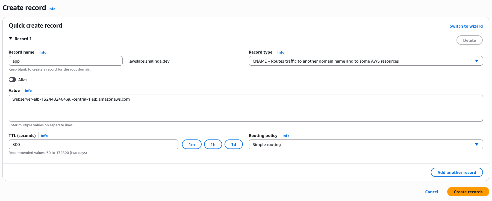
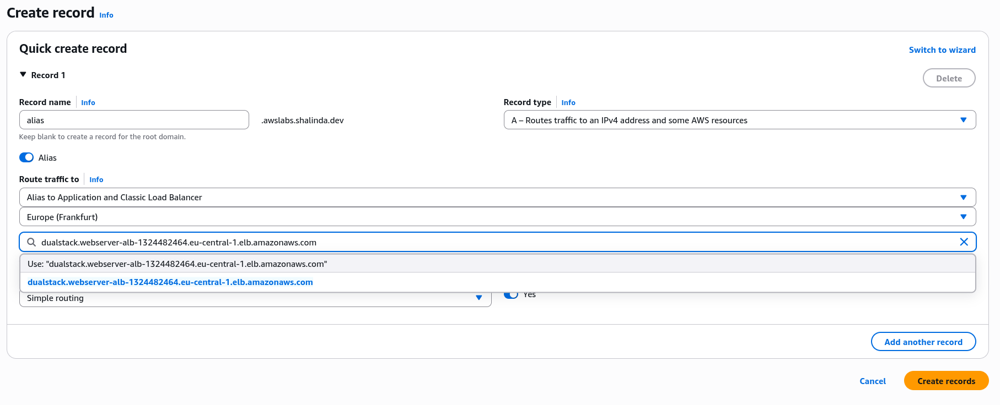
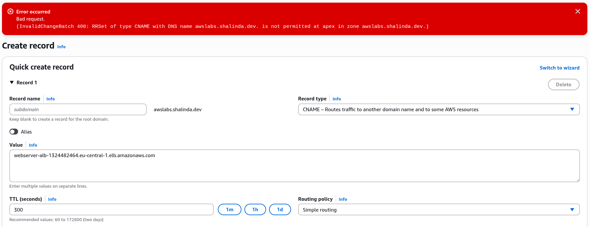
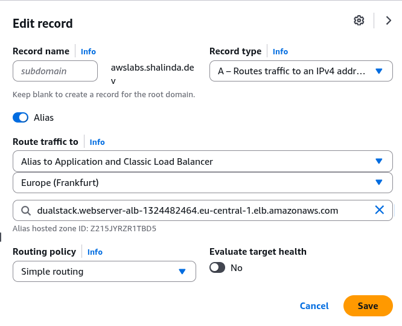

## Lab description

- CNAME: Point to a domain name.

- Alias: Point to an AWS Resource.

## Create a CNAME

- Point to our ALB

    

- Testing

    ```
    dig app.awslabs.shalinda.dev

    ; <<>> DiG 9.18.33 <<>> app.awslabs.shalinda.dev
    ;; global options: +cmd
    ;; Got answer:
    ;; ->>HEADER<<- opcode: QUERY, status: NOERROR, id: 46401
    ;; flags: qr rd ra; QUERY: 1, ANSWER: 3, AUTHORITY: 4, ADDITIONAL: 9

    ;; OPT PSEUDOSECTION:
    ; EDNS: version: 0, flags:; udp: 4096
    ;; QUESTION SECTION:
    ;app.awslabs.shalinda.dev.	IN	A

    ;; ANSWER SECTION:
    app.awslabs.shalinda.dev. 20	IN	CNAME	webserver-alb-1324482464.eu-central-1.elb.amazonaws.com.
    webserver-alb-1324482464.eu-central-1.elb.amazonaws.com. 60 IN A 3.122.58.85
    webserver-alb-1324482464.eu-central-1.elb.amazonaws.com. 60 IN A 35.156.242.173

    ;; AUTHORITY SECTION:
    eu-central-1.elb.amazonaws.com.	555 IN	NS	ns-613.awsdns-12.net.
    eu-central-1.elb.amazonaws.com.	555 IN	NS	ns-1326.awsdns-37.org.
    eu-central-1.elb.amazonaws.com.	555 IN	NS	ns-1689.awsdns-19.co.uk.
    eu-central-1.elb.amazonaws.com.	555 IN	NS	ns-417.awsdns-52.com.

    ;; ADDITIONAL SECTION:
    ns-417.awsdns-52.com.	123763	IN	A	205.251.193.161
    ns-417.awsdns-52.com.	123763	IN	AAAA	2600:9000:5301:a100::1
    ns-613.awsdns-12.net.	76233	IN	A	205.251.194.101
    ns-613.awsdns-12.net.	76233	IN	AAAA	2600:9000:5302:6500::1
    ns-1326.awsdns-37.org.	76238	IN	A	205.251.197.46
    ns-1326.awsdns-37.org.	76238	IN	AAAA	2600:9000:5305:2e00::1
    ns-1689.awsdns-19.co.uk. 76249	IN	A	205.251.198.153
    ns-1689.awsdns-19.co.uk. 76249	IN	AAAA	2600:9000:5306:9900::1

    ;; Query time: 93 msec
    ;; SERVER: 192.168.1.1#53(192.168.1.1) (UDP)
    ;; WHEN: Thu Oct 16 00:52:37 +0530 2025
    ;; MSG SIZE  rcvd: 467
    ```

    ```
    $ curl http://app.awslabs.shalinda.dev
    <h1>Hello from ip-172-31-46-175.eu-central-1.compute.internal</h1>
    ```

## Creating an Alias

- CNAME can only point to a domain name. But what if we to to point to an AWS resource.

- A handly way to do this is to create an A record (IP) with an alias enabled. **This let's you can select the deployed AWS recourse right away via dropdown.**

    


    ```
    $ curl http://alias.awslabs.shalinda.dev
    <h1>Hello from ip-172-31-46-175.eu-central-1.compute.internal</h1>
    ```

## Issue only an Alias can fix (Apex domain issue)

- When you cannot change the value of the apex domain (awslabs.shalinda.dev) that is linked to Route 53. It gives this error.

    

    **(InvalidChangeBatch 400: RRSet of type CNAME with DNS name awslabs.shalinda.dev. is not permitted at apex in zone awslabs.shalinda.dev.)**

- Fix this with an alias

    